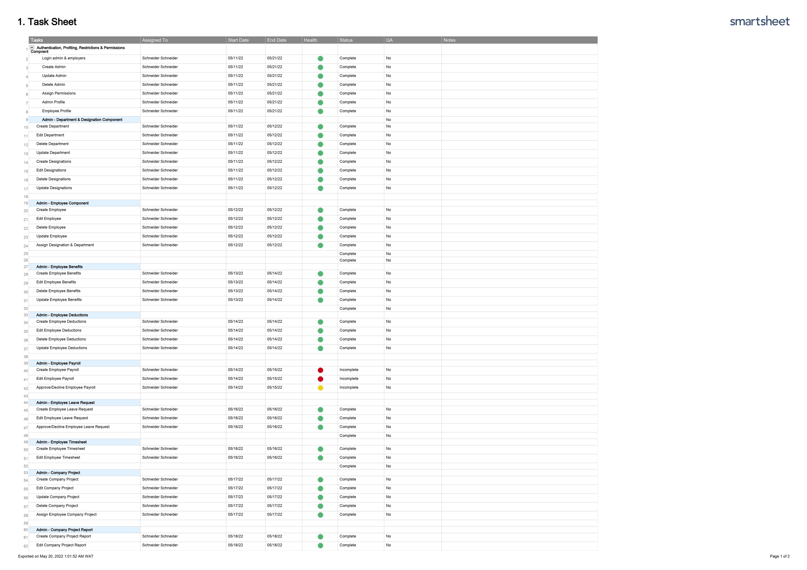
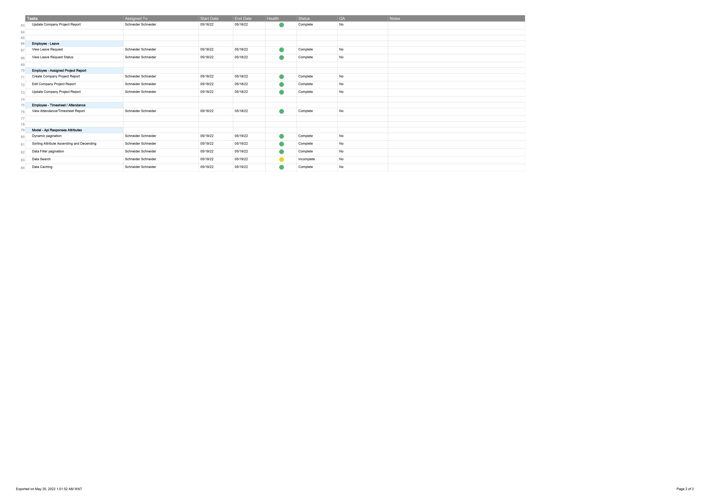

# Ems Project Execution

To execute the project please kindly do the following

- git clone *git clone https://github.com/Schneidershades/emsTonote.git*
- *Composer install*
- *cp .env.example .env* 
- *php artisan serve*

